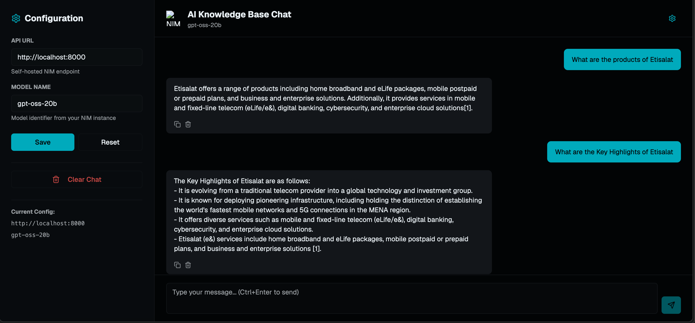
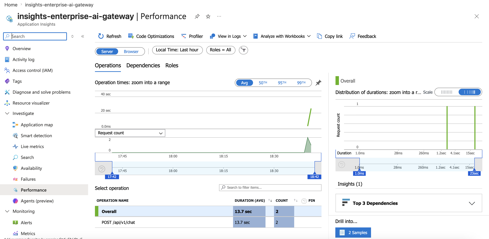

# 🧠 GenAI Knowledge Base (RAG Architecture)

A production-grade Retrieval-Augmented Generation (RAG) system built with **Azure AI Search**, **Azure OpenAI GPT-4.1-mini**, and **FastAPI**. This system allows users to query an internal knowledge base (documents) and receive AI-generated answers grounded in that specific corporate data.

## 🚀 Features
- **Multi-Source Upload**: Seamlessly ingest and index documents from multiple sources.
- **Vector Search**: Uses **Azure OpenAI text-embedding-3-small** to convert text into vectors for semantic retrieval.
- **Semantic Re-Ranking**: Employs Azure AI Search's built-in **Reranker** to drastically improve search relevance.
- **Dynamic Credentials**: Automatically loads Azure credentials from a local `.env` file.
- **Containerized**: Packaged in a Docker container for consistent deployment.

## 🛠️ Prerequisites
- **Docker**: To run the application locally.
- **Azure Subscription**:
  - Azure OpenAI Service (with `gpt-4.1-mini` and `text-embedding-3-small` deployments).
  - Azure AI Search Service (with semantic search enabled).
- **Terraform** (Optional): To provision the cloud infrastructure (managed via `run-stack.sh`).

## 📂 Project Structure
```
GenAI-Knowledge-Base/
├── terrform/                 # Terraform scripts for Azure infrastructure
├── src/
│   ├── app.py              # FastAPI Application (API Entrypoint)
│   ├── cloud_search_upload.py  # Script to upload docs to Azure AI Search
│   ├── chunk_and_embed.py    # Logic for chunking & embedding text
│   ├── sample_corp_doc.txt   # Sample document 1
│   └── sample_tesla_doc.txt  # Sample document 2
├── Dockerfile
├── requirements.txt
└── .env                      # Local environment variables
├── run-stack.sh              # Local development script
└── deploy-prod.sh            # Production compilation and deployment script
```

## ⚙️ Setup & Configuration

### 1. Environment Variables
Create a `.env` file in the root directory (the same level as `Dockerfile`) with the following details:

```env
# Azure OpenAI Credentials
AZURE_OPENAI_ENDPOINT="https://your-openai-resource.openai.azure.com"
AZURE_OPENAI_API_KEY="your-openai-api-key"
AZURE_OPENAI_CHAT_DEPLOYMENT="gpt-4.1-mini"
AZURE_OPENAI_EMBEDDING_DEPLOYMENT="text-embedding-3-small"

# Azure AI Search Credentials
AZURE_SEARCH_URL="https://your-search-service.search.windows.net"
AZURE_SEARCH_KEY="your-search-admin-key"
AZURE_KNOWLEDGE_INDEX="your-index-name"
```

### 2. Upload Documents to Azure AI Search
Before running the app, you must upload your documents to the cloud-based search index.

```bash
# Run the upload script
python src/cloud_search_upload.py
```
This script will:
1. Connect to your Azure AI Search instance.
2. Clear any old index data.
3. Re-create the index schema (including vector and semantic fields).
4. Process `sample_corp_doc.txt` and `sample_tesla_doc.txt`.
5. Upload their embeddings and text to the cloud.

## 🏃‍♂️ Running the Application

We have provided a convenient shell script to build the Docker image and run the container.

```bash
# Run this script to start the application
./run-stack.sh
```

This script will:
1.  Apply any Terraform changes (if needed).
2.  Extract credentials from the Terraform output.
3.  Rebuild the Docker image (ensuring you have the latest code).
4.  Stop and remove any existing container named `rag-service-prod`.
5.  Start the container with all necessary environment variables.

Alternatively, you can run the commands manually:

```bash
# Build the image
docker build -t genai-knowledge-base:v1 .

# Run the container
docker run -d \
  -p 8000:8000 \
  --name rag-service-prod \
  -e AZURE_OPENAI_ENDPOINT="$AZURE_OPENAI_ENDPOINT" \
  -e AZURE_OPENAI_API_KEY="$AZURE_OPENAI_API_KEY" \
  -e AZURE_OPENAI_CHAT_DEPLOYMENT="gpt-4.1-mini" \
  -e AZURE_SEARCH_URL="$AZURE_SEARCH_URL" \
  -e AZURE_SEARCH_KEY="$AZURE_SEARCH_KEY" \
  -e AZURE_KNOWLEDGE_INDEX="$AZURE_KNOWLEDGE_INDEX" \
  genai-knowledge-base:v1
```

## 🧪 Testing
Once the container is running, the API will be available at `http://localhost:8000`.



**GET**: `http://localhost:8000/chat`

Send a JSON body like:
```json
{
    "query": "What are the products and offering of Etisalat"
}
```
The service will:
1. Embed your query.
2. Query Azure AI Search.
3. Use the Semantic Reranker to refine results.
4. Generate an answer using GPT-4.1-mini.
5. Return the answer along with citations and logs.

## 🧪 Open Telemetry
You can check the system performance using Azure OpenTelemetry and Application Insights.



### 2. High-Scale Architecture Diagram

To handle 10,000 concurrent users and 1 million requests securely without encountering throttling or latency spikes, use the following architectural pattern:


#### Key Architectural Highlights:
1. **The Core Gateway (APIM):** Sits directly in front of your LLMs to balance traffic across multiple Azure OpenAI instances deployed in different regions, effectively pooling your available Tokens Per Minute (TPM).
2. **KEDA Concurrent Auto-Scaling:** Your Azure Container Apps track active *HTTP concurrency* rules rather than traditional CPU/Memory thresholds.
3. **AI Search Replica Balancing:** Horizontal replicas share the read/query retrieval overhead to support massive volumes of simultaneous vector searches.

---